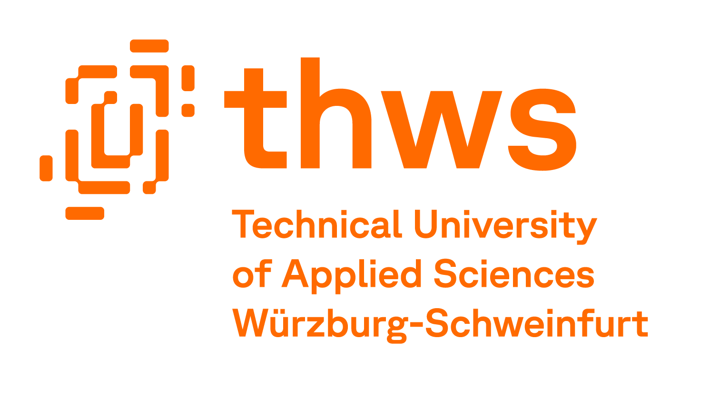
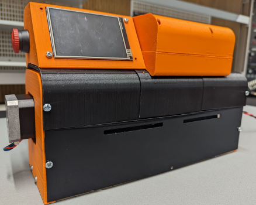

<picture>
  
</picture>
 

# Resistor Reel Cutter Machine

<picture>
  
</picture>

## Table of Contents 📃
- [Collaborators 👥](#collaborators)
- [Resistor Reel Cutter Machine](#resistor-reel-cutter-machine-1)
- [Documentation](#documentation)

## Collaborators

| Team Members | Roles |
| ------------ | ----- |
| [Sai Karthik Shankar](https://github.comSai-Karthik-Shankar) | *Project Leader*  **Mechanical** (Cutting Module and Housing) |
| [Sathvick Bindinganavale Srinath](https://github.comSathvick11) | **Software & Electrical** (Arduino codefor Actuation and  wiring plan) |
| [Aniketh Padmakar](https://github.com/anibulbs) |**Minutes Taker / Software** (Display software andDisplay arduino code ) |
| Samrat Shantesh Ukkali | Concept of PCB Design |

## Resistor Reel Cutter Machine
Hello everyone 👋

This is the GitHub repository for the engineering project "**Resistor Reel Cutter Machine**"which was designed at the [Technical University of Applied Sciences Würzburg - Schweinfurt](https://www.thws.de)

In this repository, you can find the report for the concept and usage of the product in `Report/Engineering_Project_Report.pdf`. To understand better about the working of the actuators and the HMI display, please refer to the folders `Code` and `Nextion_Setup_V1.ino` respectively.

## Documentation
For more documentation about the project, please refer to the report [here](Report/Engineering_Project_Report.pdf)